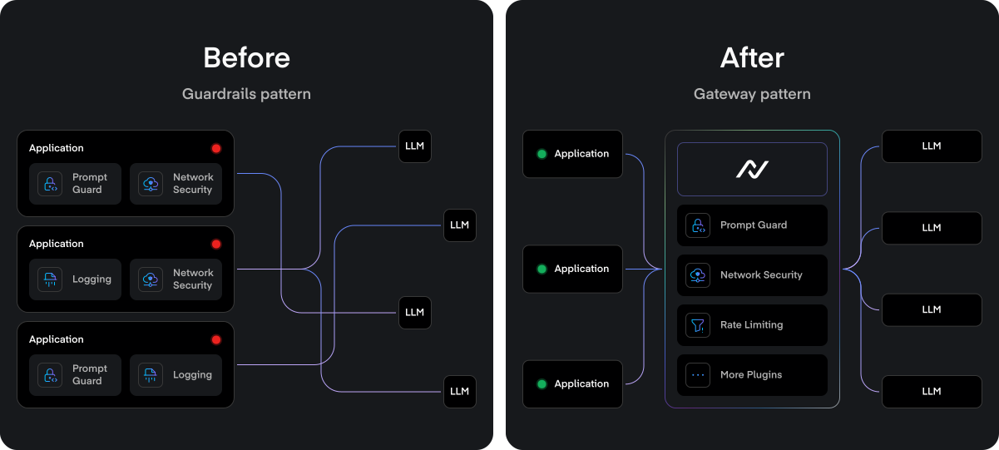

# TrustGate Helm Chart

<div align="center">


*A Production-Grade TrustGate for Kubernetes*
</div>

## Components


TrustGate consists of several key components:

1. **Control Plane**
   - Manages API configurations and policies
   - Handles authentication and authorization
   - Provides admin API interface
   - Manages rate limiting and quotas
   - Monitors system health

2. **Data Plane**
   - Routes API traffic
   - Enforces policies in real-time
   - Handles load balancing
   - Provides caching and optimization
   - Collects metrics and traces

3. **Redis Cluster**
   - Distributed caching
   - Rate limiting state
   - Real-time analytics
   - High availability with master-replica setup

4. **PostgreSQL** (Optional)
   - Stores configuration
   - Maintains audit logs
   - Tracks usage statistics
   - Supports read replicas for scaling

5. **AI Firewall** (Optional, Enterprise Feature)
   - Content moderation
   - Jailbreak detection
   - Prompt injection protection
   - Toxicity filtering
   - Runs as a separate service with its own API

## Resource Requirements

| Component | CPU Requests | CPU Limits | Memory Requests | Memory Limits | Storage |
|-----------|--------------|------------|-----------------|---------------|----------|
| Data Plane | 4000m | 8000m | 8Gi | 16Gi | - |
| Control Plane | 100m | 200m | 1Gi | 2Gi | - |
| AI Firewall | 4000m | 8000m | 8Gi | 16Gi | - |
| Moderation | 4000m | 8000m | 8Gi | 16Gi | - |
| Redis | 500m | 1000m | 1Gi | 2Gi | 10Gi |
| PostgreSQL* | 500m | 1000m | 1Gi | 2Gi | 10Gi |

> **Note**: Resource requirements can be adjusted based on your workload. These are recommended values for production deployments.

> **Important**: For production deployments, we strongly recommend using a managed PostgreSQL service (like AWS RDS, GCP Cloud SQL, or Azure Database) instead of running PostgreSQL in the cluster. This provides:
> - Better reliability and data durability
> - Automatic backups and point-in-time recovery
> - Simplified maintenance and updates
> - Built-in high availability
> - Independent scaling of database resources

## Prerequisites

- Kubernetes 1.19+ or OpenShift 4.10+
- Helm 3.2.0+
- Ingress controller (nginx-ingress recommended)
- cert-manager (optional, for TLS)
- Prometheus + Grafana (optional, for monitoring)

## Quick Start

For a more guided installation experience, use our deployment script:

```bash
# Download the deployment script
git clone https://github.com/NeuralTrust/trustgate-helm-charts.git
cd trustgate-helm-charts

# copy the .env.example file to .env
cp .env.example .env

# If you are deploying to Kubernetes
chmod +x deploy.sh
# If you are deploying to OpenShift
chmod +x deploy-openshift.sh

# Run the deployment to Kubernetes
./deploy.sh
# Run the deployment to OpenShift
./deploy-openshift.sh
```

The script will:
- Check for required dependencies (cert-manager, Prometheus)
- Create necessary secrets for PostgreSQL and Redis
- Deploy TrustGate with sensible defaults
- Wait for LoadBalancer IPs to be assigned (with timeout)
- Generate test scripts with the actual deployment values
- Provide access information after deployment

### Enteriprise version

To deploy the enterprise version, you need to have a Google service account JSON key file from NeuralTrust.
Then, you need to set the GOOGLE_APPLICATION_CREDENTIALS environment variable to the path of the JSON key file.

```bash
export GOOGLE_APPLICATION_CREDENTIALS=/path/to/your/google-service-account.json
```

### Enabling the AI Firewall and Moderation (Enterprise Feature)

The AI Firewall and Moderation component provides advanced content moderation and jailbreak protection:

```bash
# Enable the firewall during installation
ENABLE_FIREWALL=true ENABLE_MODERATION=true ./deploy-shared.sh
```

You'll need:
- A Google service account JSON key file from NeuralTrust
- A Hugging Face API key for model downloads

The script will guide you through providing these credentials.

## Testing Your Deployment

After deployment, the script will automatically generate test scripts that you can use to verify your installation and explore TrustGate's features.

Open a new terminal and run the following command to port forward the admin API:
```bash
kubectl port-forward svc/trustgate-control-plane -n trustgate 8080:80
```
Open a new terminal and run the following command to port forward the proxy API:
```bash
kubectl port-forward svc/trustgate-data-plane -n trustgate 8081:80
```

### Rate Limiter Test

The `test_rate_limiter.sh` script demonstrates how to create a gateway with rate limiting and test it with multiple requests:
```bash
export ADMIN_TOKEN=$(./generate-jwt.sh "your SERVER_SECRET_KEY")
./test_rate_limiter.sh
```

This script will:
- Create a gateway with rate limiting configured
- Create an API key for authentication
- Set up a service and routing rules
- Make multiple requests to demonstrate rate limiting in action
- Show how rate limits are applied globally, per IP, and per API key

### Firewall Test (if enabled) and Moderation Test (if enabled)

If you enabled the firewall component, a `test_combined_security.sh` script will be generated:

```bash
export ADMIN_TOKEN=$(./generate-jwt.sh "your SERVER_SECRET_KEY")
./test_combined_security.sh
```

This script will:
- Create a gateway with firewall protection
- Create an API key for authentication
- Set up a service and routing rules with the firewall plugin and rate limiter plugin
- The firewall plugin has two options:
  - Fast model: less accurate, faster (less 100ms latency)
  - Large model: more accurate, slower (less 150ms latency)
- Test the gateway with both malicious and safe content
- Demonstrate how the firewall blocks potentially harmful content
- Demonstrate how the AI Gateway masks sensitive data

## Detailed Configuration

### Environment Variables

TrustGate uses the following environment variables for configuration. These are automatically set by the Helm chart, but can be customized as needed:

```yaml
# Core configuration
LOG_LEVEL: "info"  # Log level (debug, info, warn, error)
SERVER_BASE_DOMAIN: "example.com"  # Base domain for the gateway
SERVER_ADMIN_PORT: "8080"  # Control Plane API port
SERVER_METRICS_PORT: "9090"  # Prometheus metrics port
SERVER_PROXY_PORT: "8081"  # Data Plane API port

# Database configuration
DATABASE_HOST: "trustgate-postgresql"  # PostgreSQL hostname
DATABASE_PORT: "5432"  # PostgreSQL port
DATABASE_USER: "trustgate"  # PostgreSQL username
DATABASE_PASSWORD: "your-password"  # PostgreSQL password
DATABASE_NAME: "trustgate"  # PostgreSQL database name
DATABASE_SSL_MODE: "disable"  # PostgreSQL SSL mode

# Redis configuration
REDIS_HOST: "trustgate-redis-master"  # Redis hostname
REDIS_PORT: "6379"  # Redis port
REDIS_PASSWORD: "your-redis-password"  # Redis password
REDIS_DB: "0"  # Redis database number
```

### Managing Secrets

Sensitive information like database passwords, Redis passwords, and API keys are stored as Kubernetes secrets. The Helm chart creates these secrets automatically:

```yaml
# PostgreSQL Secret (created by the PostgreSQL subchart)
apiVersion: v1
kind: Secret
metadata:
  name: {{ include "trustgate.postgresql.secretName" . }}
type: Opaque
data:
  password: {{ .Values.postgresql.auth.password | b64enc }}

# Redis Secret (created by the Redis subchart)
apiVersion: v1
kind: Secret
metadata:
  name: {{ include "trustgate.redis.secretName" . }}
type: Opaque
data:
  redis-password: {{ .Values.redis.auth.password | b64enc }}

# Firewall JWT Secret (created by the deploy-shared.sh script)
apiVersion: v1
kind: Secret
metadata:
  name: firewall-jwt-secret
type: Opaque
data:
  JWT_SECRET: {{ $jwtSecret | b64enc }}

# Hugging Face API Key Secret (created by the deploy-shared.sh script)
apiVersion: v1
kind: Secret
metadata:
  name: hf-api-key
type: Opaque
data:
  HUGGINGFACE_TOKEN: {{ $hfApiKey | b64enc }}
```

The `deploy-shared.sh` script handles the creation of these secrets:

```bash
# PostgreSQL password
PG_PASSWORD=$(openssl rand -hex 16)
echo "PostgreSQL Password: $PG_PASSWORD" > pg_credentials.txt

# Redis password
REDIS_PASSWORD=$(openssl rand -hex 16)
echo "Redis Password: $REDIS_PASSWORD" > redis_credentials.txt

# JWT Secret for Firewall
JWT_SECRET=$(openssl rand -hex 32)
echo "JWT Secret: $JWT_SECRET" > firewall_jwt_credentials.txt

# Create Hugging Face API key secret
kubectl create secret generic hf-api-key \
  --from-literal=HUGGINGFACE_TOKEN=$HF_API_KEY \
  --namespace=$NAMESPACE \
  --dry-run=client -o yaml | kubectl apply -f -

# Create JWT secret for firewall API
kubectl create secret generic firewall-jwt-secret \
  --from-literal=JWT_SECRET=$JWT_SECRET \
  --namespace=$NAMESPACE \
  --dry-run=client -o yaml | kubectl apply -f -
```

### Example: Production Setup

```yaml
# production-values.yaml

global:
  storageClass: "managed-premium"

controlPlane:
  replicaCount: 3
  resources:
    requests:
      cpu: 1000m
      memory: 2Gi
    limits:
      cpu: 2000m
      memory: 4Gi
  ingress:
    annotations:
      cert-manager.io/cluster-issuer: letsencrypt-prod
    hosts:
      admin: admin.api.company.com
    tls:
      - secretName: admin-tls
        hosts:
          - admin.api.company.com

dataPlane:
  replicaCount: 5
  resources:
    requests:
      cpu: 2000m
      memory: 4Gi
    limits:
      cpu: 4000m
      memory: 8Gi
  ingress:
    annotations:
      cert-manager.io/cluster-issuer: letsencrypt-prod
    hosts:
      api: "*.api.company.com"
    tls:
      - secretName: api-tls
        hosts:
          - "*.api.company.com"

redis:
  architecture: replication
  replica:
    replicaCount: 3
  auth:
    password: "your-secure-password"
  master:
    persistence:
      size: 50Gi
    resources:
      requests:
        cpu: 1000m
        memory: 2Gi

postgresql:
  enabled: true
  auth:
    username: "trustgate"
    password: "your-secure-password"
    database: "trustgate"
  primary:
    persistence:
      size: 100Gi
  readReplicas:
    replicaCount: 2

firewall:
  enabled: true
  replicaCount: 2
  resources:
    requests:
      cpu: 2000m
      memory: 4Gi
    limits:
      cpu: 4000m
      memory: 8Gi
  huggingface:
    apiKeySecret: "hf-api-key"
  auth:
    jwtSecret: "firewall-jwt-secret"
  persistence:
    enabled: true
    size: 20Gi
```

## Accessing TrustGate

The deployment script will display the LoadBalancer IPs for accessing TrustGate services:

- **Admin API**: Used to configure gateways, services, and rules
- **Proxy API**: The actual API gateway that handles client requests
- **Firewall API** (if enabled): Provides content filtering and security features

If LoadBalancer IPs are not available after the timeout period, you can use port-forwarding:

```bash
kubectl port-forward svc/trustgate-control-plane -n trustgate 8080:80
kubectl port-forward svc/trustgate-data-plane -n trustgate 8081:80
kubectl port-forward svc/trustgate-firewall -n trustgate 8082:80  # If firewall is enabled
```

## Troubleshooting

### Common Issues

1. **Pod Startup Failures**
   ```bash
   kubectl get pods -n trustgate
   kubectl describe pod -n trustgate <pod-name>
   ```

2. **High Memory Usage**
   ```bash
   kubectl top pods -n trustgate
   ```

3. **Certificate Issues**
   ```bash
   kubectl get certificate -n trustgate
   kubectl describe certificate -n trustgate <cert-name>
   ```

4. **Environment Variable Issues**
   ```bash
   # Check environment variables in a pod
   kubectl exec -n trustgate <pod-name> -- env | grep SERVER
   
   # Check if secrets are properly created
   kubectl get secrets -n trustgate
   
   # Verify database connection environment variables
   kubectl exec -n trustgate <pod-name> -- env | grep DATABASE
   
   # Verify Redis connection environment variables
   kubectl exec -n trustgate <pod-name> -- env | grep REDIS
   ```

5. **Firewall Model Download Issues**
   ```bash
   # Check Hugging Face API key secret
   kubectl get secret -n trustgate hf-api-key
   
   # Check firewall logs
   kubectl logs -n trustgate -l app=firewall
   
   # Check persistent volume status
   kubectl get pvc -n trustgate
   ```

6. **Test Script Generation Issues**
   ```bash
   # Check if LoadBalancer IPs are available
   kubectl get svc -n trustgate
   
   # Verify template files exist
   ls -la tests/test_rate_limiter.sh.template
   ls -la tests/test_firewall.sh.template
   
   # Check generated test scripts
   ls -la test_rate_limiter.sh
   ls -la test_firewall.sh
   ```

7. **AKS Load Balancer Delays**
   
   When deploying on Azure Kubernetes Service (AKS), the load balancer can sometimes take a long time to provision and assign external IPs. If you see the deployment script retrying to get the load balancer IP more than 5 times, it may be more efficient to:
   
   ```bash
   # Cancel the current deployment with Ctrl+C
   
   # Check the status of services
   kubectl get svc -n trustgate
   
   # Wait a few minutes for Azure to provision the load balancer
   
   # Run the deployment script again to resume the installation
   ./deploy-shared.sh
   ```
   
   This issue is specific to cloud providers like Azure where load balancer provisioning can take several minutes. The second deployment attempt will reuse the existing resources and continue from where it left off, which is often faster than waiting for the initial timeout.

## Support and Community

- 📚 [Documentation](https://docs.neuraltrust.ai)
- 💬 [Slack Community](https://join.slack.com/t/neuraltrustcommunity/shared_invite/zt-2xl47cag6-_HFNpltIULnA3wh4R6AqBg)
- 🐛 [Report Issues](https://github.com/NeuralTrust/TrustGate/issues)
- 📧 [Email Support](mailto:support@neuraltrust.ai)

## License

Apache License 2.0 - See [LICENSE](LICENSE) for details. 