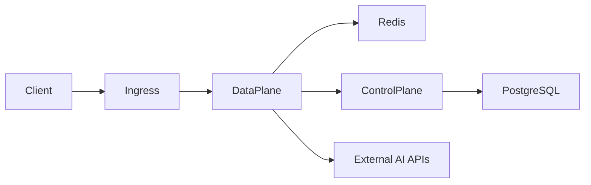
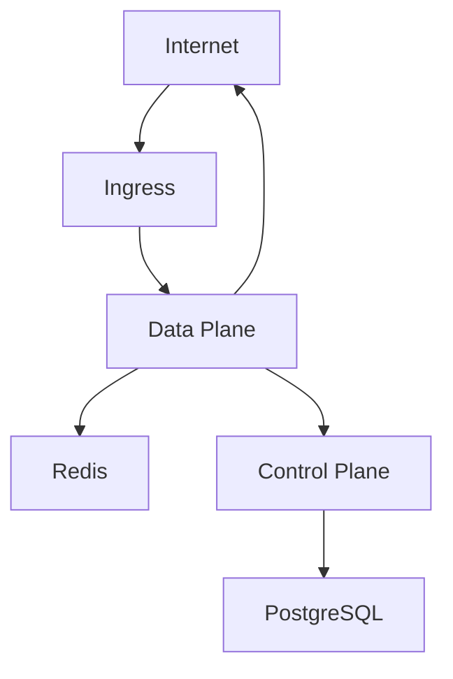

# TrustGate Helm Chart

<div align="center">


*A Production-Grade AI Gateway for Kubernetes*
</div>

## Architecture


TrustGate consists of several key components:

1. **Control Plane**
   - Manages API configurations and policies
   - Handles authentication and authorization
   - Provides admin API interface
   - Manages rate limiting and quotas
   - Monitors system health

2. **Data Plane**
   - Routes API traffic
   - Enforces policies in real-time
   - Handles load balancing
   - Provides caching and optimization
   - Collects metrics and traces

3. **Redis Cluster**
   - Distributed caching
   - Rate limiting state
   - Real-time analytics
   - High availability with master-replica setup

4. **PostgreSQL** (Optional)
   - Stores configuration
   - Maintains audit logs
   - Tracks usage statistics
   - Supports read replicas for scaling

## Prerequisites

- Kubernetes 1.19+
- Helm 3.2.0+
- Ingress controller (nginx-ingress recommended)
- cert-manager (optional, for TLS)
- Prometheus + Grafana (optional, for monitoring)

## Quick Start

```bash
# Add the repository
helm repo add trustgate https://charts.neuraltrust.ai
helm repo update

# Install with basic configuration
helm install trustgate trustgate/trustgate \
  --namespace trustgate \
  --create-namespace \
  --set config.baseDomain=your-domain.com
```

## Detailed Configuration

### Example: Production Setup

```yaml
# production-values.yaml

global:
  storageClass: "managed-premium"

controlPlane:
  replicaCount: 3
  resources:
    requests:
      cpu: 1000m
      memory: 2Gi
    limits:
      cpu: 2000m
      memory: 4Gi
  ingress:
    annotations:
      cert-manager.io/cluster-issuer: letsencrypt-prod
    hosts:
      admin: admin.api.company.com
    tls:
      - secretName: admin-tls
        hosts:
          - admin.api.company.com

dataPlane:
  replicaCount: 5
  resources:
    requests:
      cpu: 2000m
      memory: 4Gi
    limits:
      cpu: 4000m
      memory: 8Gi
  ingress:
    annotations:
      cert-manager.io/cluster-issuer: letsencrypt-prod
    hosts:
      api: "*.api.company.com"
    tls:
      - secretName: api-tls
        hosts:
          - "*.api.company.com"

redis:
  architecture: replication
  replica:
    replicaCount: 3
  auth:
    password: "your-secure-password"
  master:
    persistence:
      size: 50Gi
    resources:
      requests:
        cpu: 1000m
        memory: 2Gi

postgresql:
  enabled: true
  primary:
    persistence:
      size: 100Gi
  readReplicas:
    replicaCount: 2
```

### Network Flow Diagram



## Security Hardening

### Network Policies

The chart implements strict network policies:



### Pod Security Context

```yaml
securityContext:
  capabilities:
    drop:
    - ALL
  readOnlyRootFilesystem: true
  runAsNonRoot: true
  runAsUser: 1001
```

## Monitoring Stack

### Available Metrics

- Request latency
- Error rates
- Cache hit ratios
- API usage by endpoint
- Rate limiting statistics
- Resource utilization

### Grafana Dashboards

1. **Overview Dashboard**
   

2. **Performance Dashboard**
   

### Alert Rules

```yaml
alerting:
  rules:
    - alert: HighErrorRate
      expr: rate(http_errors_total[5m]) > 1
      for: 5m
      labels:
        severity: critical
    - alert: HighLatency
      expr: http_request_duration_seconds{quantile="0.9"} > 1
      for: 5m
      labels:
        severity: warning
```

## Scaling Guidelines

### Horizontal Scaling

1. **Data Plane**
   - Scale based on RPS (Requests Per Second)
   - Recommended: 1 replica per 1000 RPS
   - Use HPA with custom metrics

2. **Control Plane**
   - Scale based on configuration changes
   - Recommended: 3 replicas minimum
   - Scale with cluster size

3. **Redis**
   - Scale read replicas with cache usage
   - Monitor memory usage
   - Consider Redis Cluster for >50GB data

### Vertical Scaling

Resource allocation guidelines:

| Component | CPU (Request) | Memory (Request) | CPU (Limit) | Memory (Limit) |
|-----------|--------------|------------------|-------------|----------------|
| Data Plane | 1000m | 2Gi | 2000m | 4Gi |
| Control Plane | 500m | 1Gi | 1000m | 2Gi |
| Redis Master | 1000m | 2Gi | 2000m | 4Gi |
| PostgreSQL | 1000m | 2Gi | 2000m | 4Gi |

## Backup and Disaster Recovery

### PostgreSQL Backup

```bash
# Create a backup
kubectl exec -n trustgate \
  $(kubectl get pod -n trustgate -l app=postgresql -o jsonpath='{.items[0].metadata.name}') \
  -- pg_dump -U trustgate > backup.sql

# Schedule regular backups
kubectl apply -f backup-cronjob.yaml
```

### Redis Backup

```bash
# Enable Redis persistence
helm upgrade trustgate trustgate/trustgate \
  --set redis.persistence.enabled=true \
  --set redis.persistence.size=50Gi
```

## Troubleshooting

### Common Issues

1. **Connection Timeouts**
   ```bash
   kubectl get pods -n trustgate
   kubectl logs -n trustgate <pod-name>
   kubectl describe pod -n trustgate <pod-name>
   ```

2. **High Memory Usage**
   ```bash
   kubectl top pods -n trustgate
   ```

3. **Certificate Issues**
   ```bash
   kubectl get certificate -n trustgate
   kubectl describe certificate -n trustgate <cert-name>
   ```

## Support and Community

- 📚 [Documentation](https://docs.neuraltrust.ai)
- 💬 [Slack Community](https://join.slack.com/t/neuraltrustcommunity/shared_invite/zt-2xl47cag6-_HFNpltIULnA3wh4R6AqBg)
- 🐛 [Report Issues](https://github.com/NeuralTrust/TrustGate/issues)
- 📧 [Email Support](mailto:support@neuraltrust.ai)

## License

Apache License 2.0 - See [LICENSE](LICENSE) for details. 