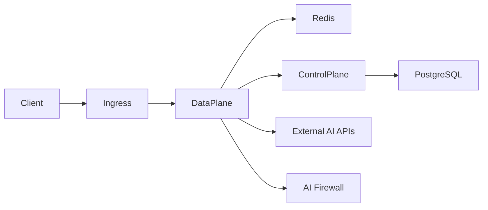
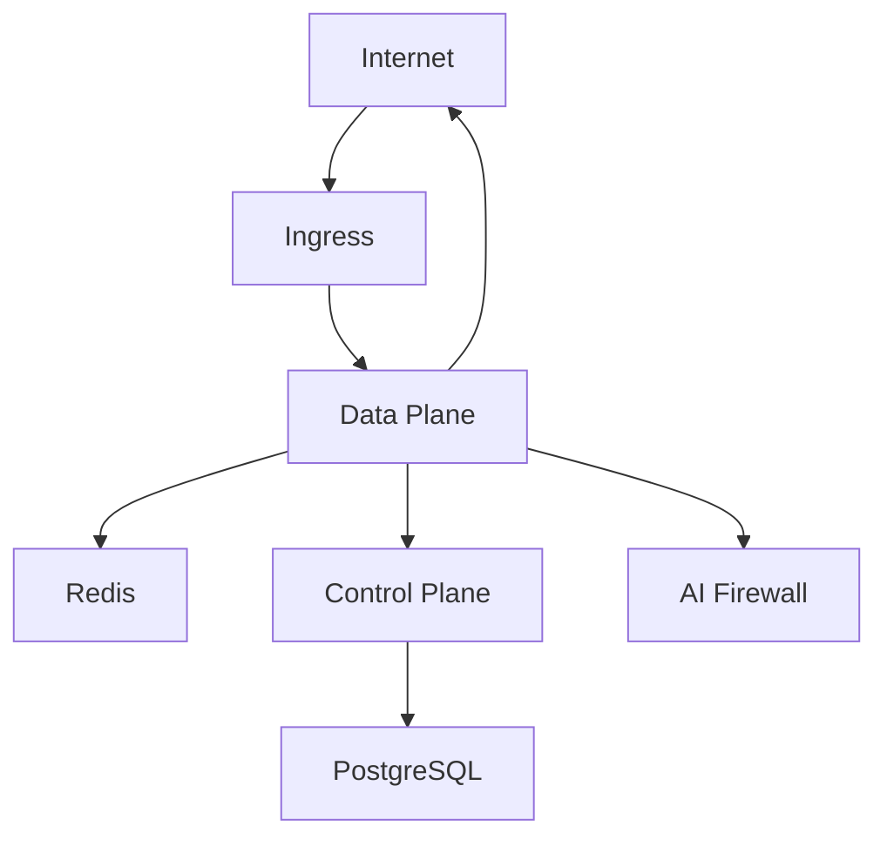

# TrustGate Helm Chart

<div align="center">


*A Production-Grade AI Gateway for Kubernetes*
</div>

## Architecture


TrustGate consists of several key components:

1. **Control Plane**
   - Manages API configurations and policies
   - Handles authentication and authorization
   - Provides admin API interface
   - Manages rate limiting and quotas
   - Monitors system health

2. **Data Plane**
   - Routes API traffic
   - Enforces policies in real-time
   - Handles load balancing
   - Provides caching and optimization
   - Collects metrics and traces

3. **Redis Cluster**
   - Distributed caching
   - Rate limiting state
   - Real-time analytics
   - High availability with master-replica setup

4. **PostgreSQL** (Optional)
   - Stores configuration
   - Maintains audit logs
   - Tracks usage statistics
   - Supports read replicas for scaling

5. **AI Firewall** (Optional, Enterprise Feature)
   - Content moderation
   - Jailbreak detection
   - Prompt injection protection
   - Toxicity filtering
   - Runs as a separate service with its own API

## Prerequisites

- Kubernetes 1.19+
- Helm 3.2.0+
- Ingress controller (nginx-ingress recommended)
- cert-manager (optional, for TLS)
- Prometheus + Grafana (optional, for monitoring)

## Quick Start

```bash
# Add the repository
helm repo add trustgate https://charts.neuraltrust.ai
helm repo update

# Install with basic configuration
helm install trustgate trustgate/trustgate \
  --namespace trustgate \
  --create-namespace \
  --set config.baseDomain=your-domain.com
```

## Using the Deployment Script

For a more guided installation experience, use our deployment script:

```bash
# Download the deployment script
curl -O https://raw.githubusercontent.com/NeuralTrust/TrustGate/main/trustgate-helm-charts/deploy-shared.sh
chmod +x deploy-shared.sh

# Run the deployment script
./deploy-shared.sh
```

The script will:
- Check for required dependencies (cert-manager, Prometheus)
- Create necessary secrets for PostgreSQL and Redis
- Deploy TrustGate with sensible defaults
- Provide access information after deployment

### Enabling the AI Firewall (Enterprise Feature)

The AI Firewall component provides advanced content moderation and jailbreak protection:

```bash
# Enable the firewall during installation
ENABLE_FIREWALL=true ./deploy-shared.sh
```

You'll need:
- A Google service account JSON key file from NeuralTrust
- A Hugging Face API key for model downloads

The script will guide you through providing these credentials.

## Detailed Configuration

### Environment Variables

TrustGate uses the following environment variables for configuration. These are automatically set by the Helm chart, but can be customized as needed:

```yaml
# Core configuration
LOG_LEVEL: "info"  # Log level (debug, info, warn, error)
SERVER_BASE_DOMAIN: "example.com"  # Base domain for the gateway
SERVER_ADMIN_PORT: "8080"  # Control Plane API port
SERVER_METRICS_PORT: "9090"  # Prometheus metrics port
SERVER_PROXY_PORT: "8081"  # Data Plane API port

# Database configuration
DATABASE_HOST: "trustgate-postgresql"  # PostgreSQL hostname
DATABASE_PORT: "5432"  # PostgreSQL port
DATABASE_USER: "trustgate"  # PostgreSQL username
DATABASE_PASSWORD: "your-password"  # PostgreSQL password
DATABASE_NAME: "trustgate"  # PostgreSQL database name
DATABASE_SSL_MODE: "disable"  # PostgreSQL SSL mode

# Redis configuration
REDIS_HOST: "trustgate-redis-master"  # Redis hostname
REDIS_PORT: "6379"  # Redis port
REDIS_PASSWORD: "your-redis-password"  # Redis password
REDIS_DB: "0"  # Redis database number
```

You can customize these values in your Helm installation:

```bash
helm install trustgate trustgate/trustgate \
  --namespace trustgate \
  --set controlPlane.env.LOG_LEVEL=debug \
  --set dataPlane.env.SERVER_BASE_DOMAIN=api.company.com
```

Or in your values file:

```yaml
controlPlane:
  env:
    LOG_LEVEL: "debug"
    SERVER_BASE_DOMAIN: "api.company.com"
    
dataPlane:
  env:
    LOG_LEVEL: "info"
    SERVER_BASE_DOMAIN: "api.company.com"
```

### Environment Variables in Deployments

The environment variables are set in the deployment manifests. Here's how they are configured in the Control Plane and Data Plane deployments:

```yaml
# Control Plane Deployment
apiVersion: apps/v1
kind: Deployment
metadata:
  name: {{ include "trustgate.fullname" . }}-control-plane
spec:
  template:
    spec:
      containers:
        - name: control-plane
          env:
            - name: LOG_LEVEL
              value: {{ .Values.controlPlane.env.LOG_LEVEL | default "info" }}
            - name: SERVER_BASE_DOMAIN
              value: {{ .Values.controlPlane.env.SERVER_BASE_DOMAIN | default "example.com" }}
            - name: SERVER_ADMIN_PORT
              value: {{ .Values.controlPlane.env.SERVER_ADMIN_PORT | default "8080" | quote }}
            - name: SERVER_METRICS_PORT
              value: {{ .Values.controlPlane.env.SERVER_METRICS_PORT | default "9090" | quote }}
            - name: DATABASE_HOST
              value: {{ include "trustgate.postgresql.fullname" . }}
            - name: DATABASE_PORT
              value: "5432"
            - name: DATABASE_USER
              value: {{ .Values.postgresql.auth.username }}
            - name: DATABASE_PASSWORD
              valueFrom:
                secretKeyRef:
                  name: {{ include "trustgate.postgresql.secretName" . }}
                  key: password
            - name: DATABASE_NAME
              value: {{ .Values.postgresql.auth.database }}
            - name: DATABASE_SSL_MODE
              value: {{ .Values.controlPlane.env.DATABASE_SSL_MODE | default "disable" }}
            - name: REDIS_HOST
              value: {{ include "trustgate.redis.fullname" . }}-master
            - name: REDIS_PORT
              value: "6379"
            - name: REDIS_PASSWORD
              valueFrom:
                secretKeyRef:
                  name: {{ include "trustgate.redis.secretName" . }}
                  key: redis-password
            - name: REDIS_DB
              value: "0"
```

### Managing Secrets

Sensitive information like database passwords, Redis passwords, and API keys are stored as Kubernetes secrets. The Helm chart creates these secrets automatically:

```yaml
# PostgreSQL Secret (created by the PostgreSQL subchart)
apiVersion: v1
kind: Secret
metadata:
  name: {{ include "trustgate.postgresql.secretName" . }}
type: Opaque
data:
  password: {{ .Values.postgresql.auth.password | b64enc }}

# Redis Secret (created by the Redis subchart)
apiVersion: v1
kind: Secret
metadata:
  name: {{ include "trustgate.redis.secretName" . }}
type: Opaque
data:
  redis-password: {{ .Values.redis.auth.password | b64enc }}

# Firewall JWT Secret (created by the deploy-shared.sh script)
apiVersion: v1
kind: Secret
metadata:
  name: firewall-jwt-secret
type: Opaque
data:
  JWT_SECRET: {{ $jwtSecret | b64enc }}

# Hugging Face API Key Secret (created by the deploy-shared.sh script)
apiVersion: v1
kind: Secret
metadata:
  name: hf-api-key
type: Opaque
data:
  HUGGINGFACE_TOKEN: {{ $hfApiKey | b64enc }}
```

The `deploy-shared.sh` script handles the creation of these secrets:

```bash
# PostgreSQL password
PG_PASSWORD=$(openssl rand -hex 16)
echo "PostgreSQL Password: $PG_PASSWORD" > pg_credentials.txt

# Redis password
REDIS_PASSWORD=$(openssl rand -hex 16)
echo "Redis Password: $REDIS_PASSWORD" > redis_credentials.txt

# JWT Secret for Firewall
JWT_SECRET=$(openssl rand -hex 32)
echo "JWT Secret: $JWT_SECRET" > firewall_jwt_credentials.txt

# Create Hugging Face API key secret
kubectl create secret generic hf-api-key \
  --from-literal=HUGGINGFACE_TOKEN=$HF_API_KEY \
  --namespace=$NAMESPACE \
  --dry-run=client -o yaml | kubectl apply -f -

# Create JWT secret for firewall API
kubectl create secret generic firewall-jwt-secret \
  --from-literal=JWT_SECRET=$JWT_SECRET \
  --namespace=$NAMESPACE \
  --dry-run=client -o yaml | kubectl apply -f -
```

### Example: Production Setup

```yaml
# production-values.yaml

global:
  storageClass: "managed-premium"

controlPlane:
  replicaCount: 3
  resources:
    requests:
      cpu: 1000m
      memory: 2Gi
    limits:
      cpu: 2000m
      memory: 4Gi
  env:
    LOG_LEVEL: "info"
    SERVER_BASE_DOMAIN: "api.company.com"
    SERVER_ADMIN_PORT: "8080"
    SERVER_METRICS_PORT: "9090"
    DATABASE_SSL_MODE: "require"
  ingress:
    annotations:
      cert-manager.io/cluster-issuer: letsencrypt-prod
    hosts:
      admin: admin.api.company.com
    tls:
      - secretName: admin-tls
        hosts:
          - admin.api.company.com

dataPlane:
  replicaCount: 5
  resources:
    requests:
      cpu: 2000m
      memory: 4Gi
    limits:
      cpu: 4000m
      memory: 8Gi
  env:
    LOG_LEVEL: "info"
    SERVER_BASE_DOMAIN: "api.company.com"
    SERVER_PROXY_PORT: "8081"
    SERVER_METRICS_PORT: "9090"
  ingress:
    annotations:
      cert-manager.io/cluster-issuer: letsencrypt-prod
    hosts:
      api: "*.api.company.com"
    tls:
      - secretName: api-tls
        hosts:
          - "*.api.company.com"

redis:
  architecture: replication
  replica:
    replicaCount: 3
  auth:
    password: "your-secure-password"
  master:
    persistence:
      size: 50Gi
    resources:
      requests:
        cpu: 1000m
        memory: 2Gi

postgresql:
  enabled: true
  auth:
    username: "trustgate"
    password: "your-secure-password"
    database: "trustgate"
  primary:
    persistence:
      size: 100Gi
  readReplicas:
    replicaCount: 2

firewall:
  enabled: true
  replicaCount: 2
  resources:
    requests:
      cpu: 2000m
      memory: 4Gi
    limits:
      cpu: 4000m
      memory: 8Gi
  huggingface:
    apiKeySecret: "hf-api-key"
  auth:
    jwtSecret: "firewall-jwt-secret"
  persistence:
    enabled: true
    size: 20Gi
```

### Network Flow Diagram



## Security Hardening

### Network Policies

The chart implements strict network policies:



### Pod Security Context

```yaml
securityContext:
  capabilities:
    drop:
    - ALL
  readOnlyRootFilesystem: true
  runAsNonRoot: true
  runAsUser: 1001
```

### Environment Variables and Secrets

Sensitive information like database passwords and API keys are stored as Kubernetes secrets and injected as environment variables:

```yaml
# Example of how secrets are managed
apiVersion: v1
kind: Secret
metadata:
  name: trustgate-env-secrets
  namespace: trustgate
type: Opaque
data:
  DATABASE_PASSWORD: base64-encoded-password
  REDIS_PASSWORD: base64-encoded-password
  
---
# Reference in deployment
env:
  - name: DATABASE_PASSWORD
    valueFrom:
      secretKeyRef:
        name: trustgate-env-secrets
        key: DATABASE_PASSWORD
```

## Scaling Guidelines

### Horizontal Scaling

1. **Data Plane**
   - Scale based on RPS (Requests Per Second)
   - Recommended: 1 replica per 1000 RPS
   - Use HPA with custom metrics

2. **Control Plane**
   - Scale based on configuration changes
   - Recommended: 3 replicas minimum
   - Scale with cluster size

3. **Redis**
   - Scale read replicas with cache usage
   - Monitor memory usage
   - Consider Redis Cluster for >50GB data

4. **AI Firewall**
   - Scale based on scanning volume
   - Recommended: 1 replica per 500 RPS
   - Consider GPU nodes for higher performance

### Vertical Scaling

Resource allocation guidelines:

| Component | CPU (Request) | Memory (Request) | CPU (Limit) | Memory (Limit) |
|-----------|--------------|------------------|-------------|----------------|
| Data Plane | 1000m | 2Gi | 2000m | 4Gi |
| Control Plane | 500m | 1Gi | 1000m | 2Gi |
| Redis Master | 1000m | 2Gi | 2000m | 4Gi |
| PostgreSQL | 1000m | 2Gi | 2000m | 4Gi |
| AI Firewall | 2000m | 4Gi | 4000m | 8Gi |

## Backup and Disaster Recovery

### PostgreSQL Backup

```bash
# Create a backup
kubectl exec -n trustgate \
  $(kubectl get pod -n trustgate -l app=postgresql -o jsonpath='{.items[0].metadata.name}') \
  -- pg_dump -U trustgate > backup.sql

# Schedule regular backups
kubectl apply -f backup-cronjob.yaml
```

### Redis Backup

```bash
# Enable Redis persistence
helm upgrade trustgate trustgate/trustgate \
  --set redis.persistence.enabled=true \
  --set redis.persistence.size=50Gi
```

### Firewall Model Backup

The AI Firewall component stores downloaded models in a persistent volume. To back up these models:

```bash
# Create a backup of the models
kubectl exec -n trustgate \
  $(kubectl get pod -n trustgate -l app=firewall -o jsonpath='{.items[0].metadata.name}') \
  -- tar -czf /tmp/models-backup.tar.gz /app/models

# Copy the backup to your local machine
kubectl cp trustgate/$(kubectl get pod -n trustgate -l app=firewall -o jsonpath='{.items[0].metadata.name}'):/tmp/models-backup.tar.gz ./models-backup.tar.gz
```

## Troubleshooting

### Common Issues

1. **Connection Timeouts**
   ```bash
   kubectl get pods -n trustgate
   kubectl logs -n trustgate <pod-name>
   kubectl describe pod -n trustgate <pod-name>
   ```

2. **High Memory Usage**
   ```bash
   kubectl top pods -n trustgate
   ```

3. **Certificate Issues**
   ```bash
   kubectl get certificate -n trustgate
   kubectl describe certificate -n trustgate <cert-name>
   ```

4. **Environment Variable Issues**
   ```bash
   # Check environment variables in a pod
   kubectl exec -n trustgate <pod-name> -- env | grep SERVER
   
   # Check if secrets are properly created
   kubectl get secrets -n trustgate
   
   # Verify database connection environment variables
   kubectl exec -n trustgate <pod-name> -- env | grep DATABASE
   
   # Verify Redis connection environment variables
   kubectl exec -n trustgate <pod-name> -- env | grep REDIS
   ```

5. **Firewall Model Download Issues**
   ```bash
   # Check Hugging Face API key secret
   kubectl get secret -n trustgate hf-api-key
   
   # Check firewall logs
   kubectl logs -n trustgate -l app=firewall
   
   # Check persistent volume status
   kubectl get pvc -n trustgate
   ```

## Using the AI Firewall

The AI Firewall component provides advanced content moderation and jailbreak protection. To use it:

1. **Get the JWT token**
   ```bash
   cat firewall_jwt_credentials.txt
   ```

2. **Make requests to the Firewall API**
   ```bash
   curl -X POST https://firewall.example.com/v1/firewall \
     -H "Authorization: Bearer YOUR_JWT_TOKEN" \
     -H "Content-Type: application/json" \
     -d '{"input": "Your text to scan"}'
   ```

3. **Integrate with your applications**
   ```python
   import requests
   
   def check_content(text):
       response = requests.post(
           "https://firewall.example.com/v1/firewall",
           headers={
               "Authorization": "Bearer YOUR_JWT_TOKEN",
               "Content-Type": "application/json"
           },
           json={"input": text}
       )
       return response.json()
   ```

## Support and Community

- 📚 [Documentation](https://docs.neuraltrust.ai)
- 💬 [Slack Community](https://join.slack.com/t/neuraltrustcommunity/shared_invite/zt-2xl47cag6-_HFNpltIULnA3wh4R6AqBg)
- 🐛 [Report Issues](https://github.com/NeuralTrust/TrustGate/issues)
- 📧 [Email Support](mailto:support@neuraltrust.ai)

## License

Apache License 2.0 - See [LICENSE](LICENSE) for details. 